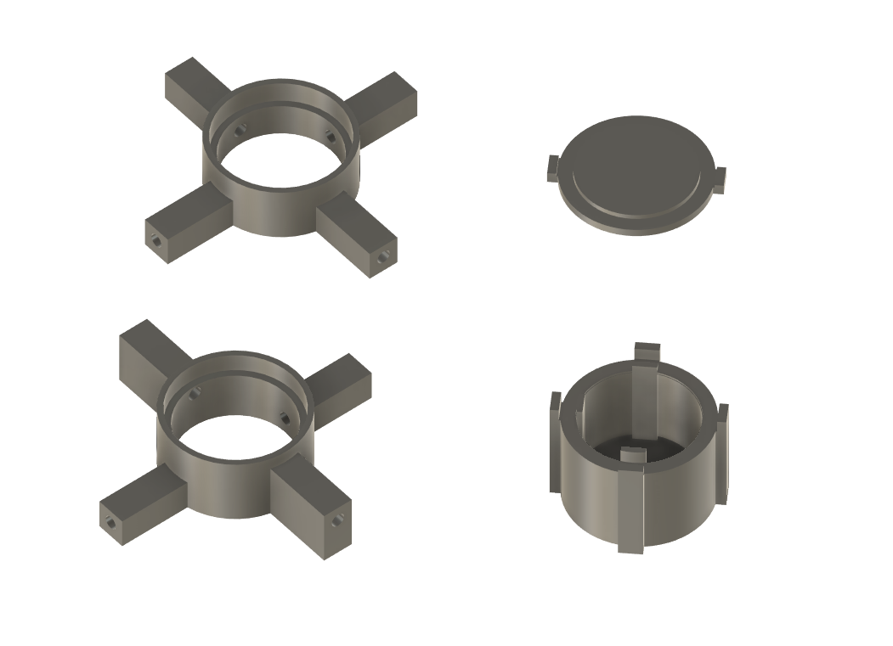

# Turnstile antenna - 3D files for rod holders

### ◾ About the project

**Turnstile antenna** is my after hours antenna project, that is described in detail [on my blog](https://alicja.space).

In this repository you can find 3D files for the rod holders that can be helpful in assembly. Feel free to modify it for your needs.